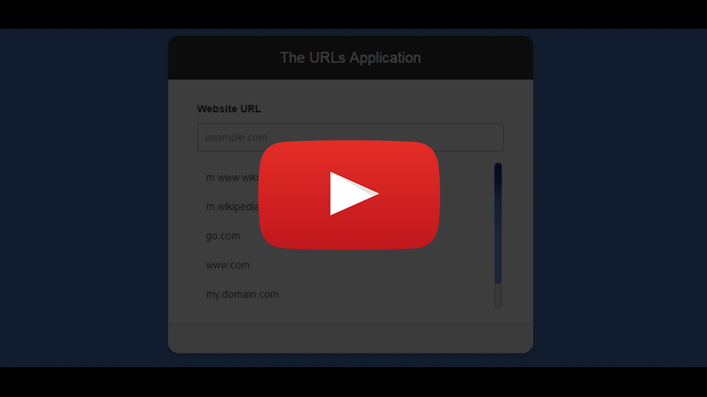
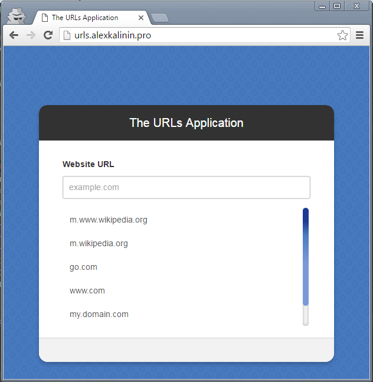

# urls-test-task

Simple todo-like test task.

### See demo here: [urls.alexkalinin.pro](http://urls.alexkalinin.pro/)

### See this project screencast on YouTube:
<a href="https://www.youtube.com/watch?v=FwAvaRYmnAg&index=1&list=PL4Sb1Xi46uLW12ZcLEh5j7WDXNPQ_PYzn" target="_blank">
   
</a>

### Used tools:
* jquery
* alfa-domains.js
* rails 4

### Preview



### Block domains:

created functionality for black listing some domains by regex:

```ruby
# on server
# RAILS_ENV=production rails c

BlackList.create url: "blockKeyword"
```
